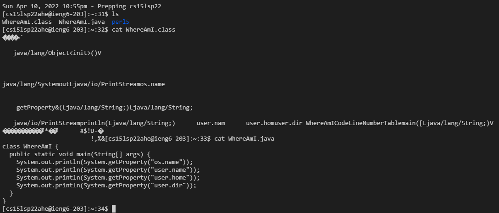

# **Week 2 Lab Report**
___
## Installing VScode

A simple process really, to install VScode, all I had to do go to the [Visual Studio Code website](https://code.visualstudio.com/) and download right version for my PC. In my case I downloaded the windows ver. and installed it. Upon opending the application, everything seemed to run fine.

___
## Remotely Connecting

To remotely connect to the CSE15L account, I first had to make sure that I had OpenSSH installed, which allows me to connect to a server on my client. Thankfully it was already installed so all I had to do was open up a terminal and use `ssh username@hostname` to connect. Then, I had to enter the password for the account and bam... remote connection successful.

___
## Trying Some Commands

There were a a decent amount of commands to use but some noticeable ones were:

* **cd** - changes current directory
* **cat** - displays contents of specified file
* **ls** - lists all files in current directory

___
## Moving Files with scp

The process of moving files from client to server was not that difficult. Only taking a few minutes, using the scp command was just `scp (file name) (recipient)` and then a password promt. Entering the password was what made this process longer than it should have been.

___
## Setting an SSH Key
___
## Optimizing Remote Running

Lab 2 Screenshot:
