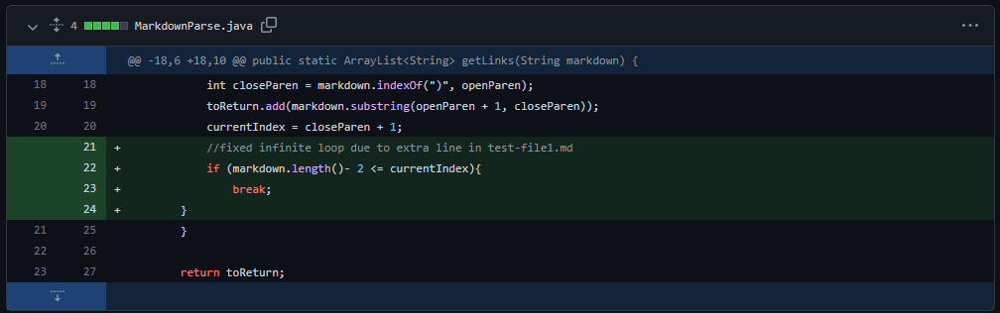
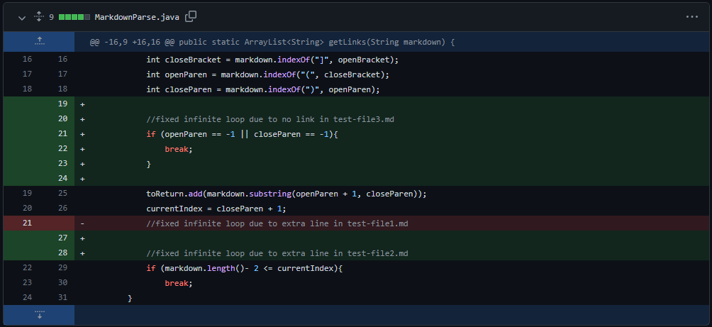
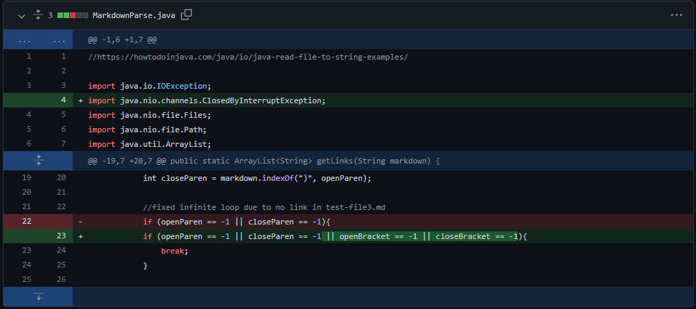

# **Week 4 Lab Report**
___
## Fixing Bugs

### Fix #1:

This code change in the `MarkdownParse.java` file was meant to fix the very [first test file](https://github.com/henrigy/markdown-parser/blame/main/test-file2.md) we were given. This test file contained an extra line at the end which was empty and ended up causing an infinite loop to the tester. With this fix the tester was able to run the test fine with the extra line at the end.

### Fix #2:

The reason for this code change in `MarkdownParse.java` was yet another infinite loop caused by this [test file](https://github.com/henrigy/markdown-parser/blame/main/test-file3.md). The error was caused by an index out of bounds when searching for an open parentheses since there was no parentheses after the line `[link3]`. With this fix, the loop would break if it was unable to find and parentheses after an end bracket.

### Fix #3:

This was our final code change in the `MarkdownParse.java` file which addressed yet another infinite loop bug caused by the symptom of `IndexOutOfBoundsException`. The test cases that broke this tester was [`test-file2.md`](https://github.com/henrigy/markdown-parser/blame/main/test1.md) and [`test-file8.md`](https://github.com/henrigy/markdown-parser/blame/main/test7.md) from lab 4. This fix stopped an infinite loop from occuring due to a bracket showing up and starting a loop that won't end.