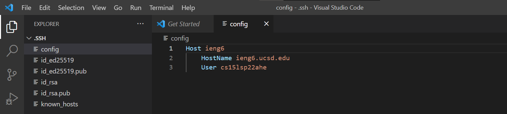
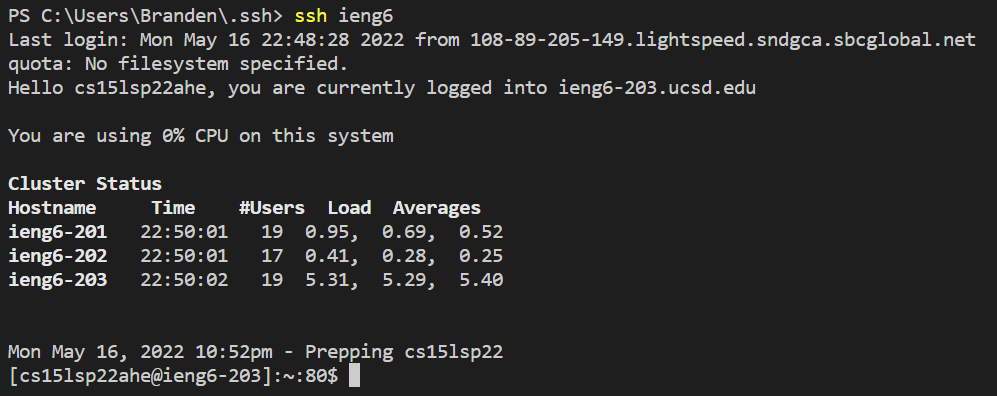
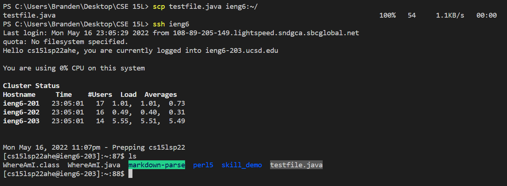
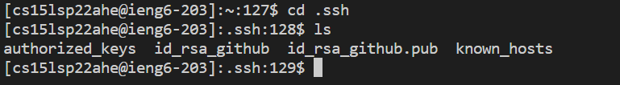
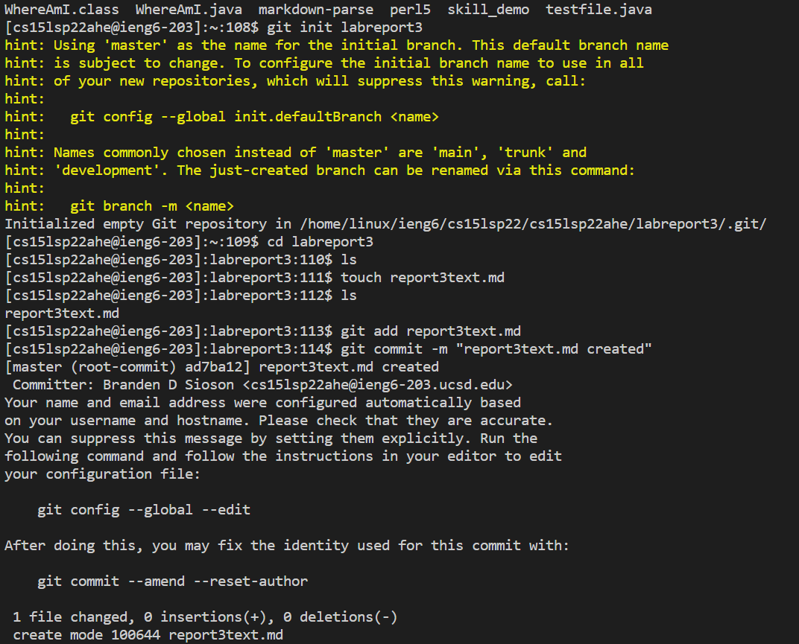
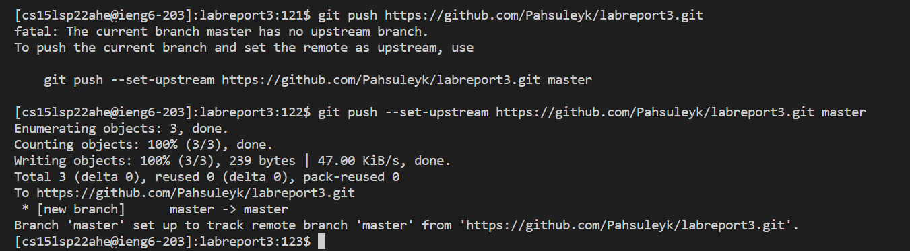
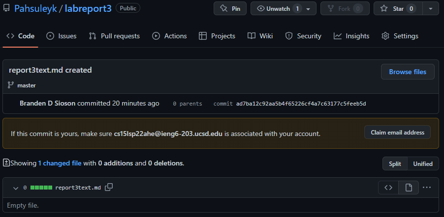

# **Week 6 Lab Report**
___
## Streamling ssh Configuration

Making an ssh key to login onto the ieng6 server account really speeds up the login process. Still, it takes quite a bit of time to type out the full username and hostname (i.e. `ssh cs15lsp22xxx@ieng6.ucsd.edu`). This can be further configured to streamline the login process via a config file in the `.ssh` directory. 

Below is my `.ssh/config` file created and edited using VScode:

Then I ran a test by loggin into my remote server account using the alias:

Final test used `scp` command to copy a file from my pc onto the remote server using the alias:

___
## Setup Github Access from ieng6

This process was a little more challenging then the rest but it goes by first creating a ssh key on your remote account if one does not already exist and copying the contents of the `.pub` key. Then one would go onto github, settings, SSH and GPG keys, then click New SSH Key and pasting the contents of the `.pub` file into the key.

Here's the key in Github:

And here's the key location in the remote server:

Then after gettting that set up, I made a repository, and created a test file to commit and push a change onto Github via the ieng6 account:

Finally heres the commit on Github itself:
[https://github.com/Pahsuleyk/labreport3/commit/ad7ba12c92aa5b4f65226cf4a7c63177c5feeb5d](https://github.com/Pahsuleyk/labreport3/commit/ad7ba12c92aa5b4f65226cf4a7c63177c5feeb5d)

___
## Copy whole directories with `scp -r`

We've known about `scp` which allows us to copy over a file at a time. But by adding `-r` after `scp`, we are able to copy whole directories in a single command. Doing so we optimize our time and spend less effort trying to individually copy files. This command is really helpful for bulk files needing to be copied.