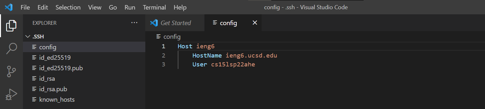
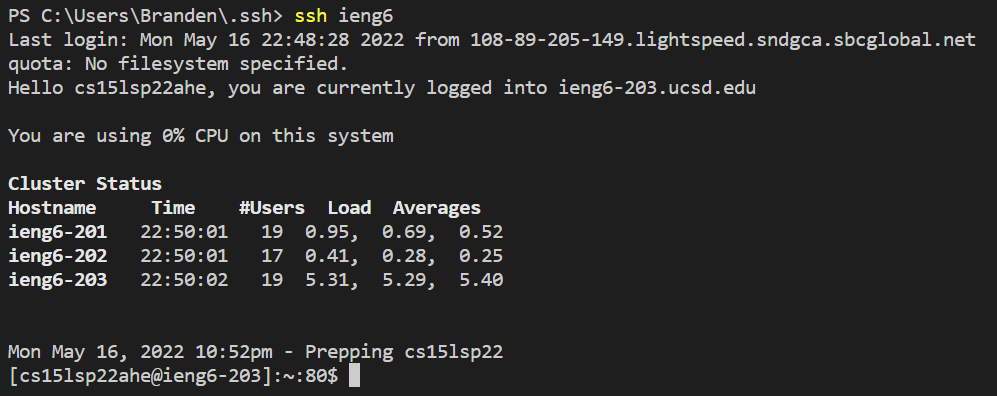

# **Week 6 Lab Report**
___
## Streamling ssh Configuration

Making an ssh key to login onto the ieng6 server account really speeds up the login process. Still, it takes quite a bit of time to type out the full username and hostname (i.e. `ssh cs15lsp22xxx@ieng6.ucsd.edu`). This can be further configured to streamline the login process via a config file in the `.ssh` directory. 

Below is my `.ssh/config` file created and edited using VScode:

Then I ran a test by loggin into my remote server account using the alias:

___
## Setup Github Access from ieng6

___
## Copy whole directories with `scp -r`