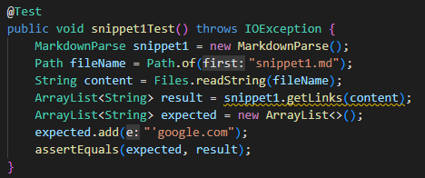
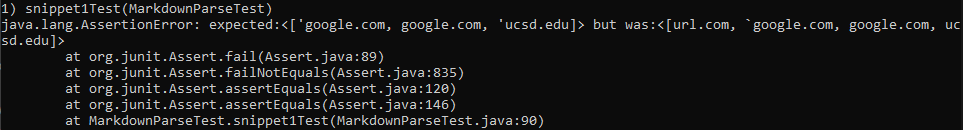
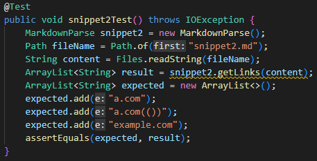
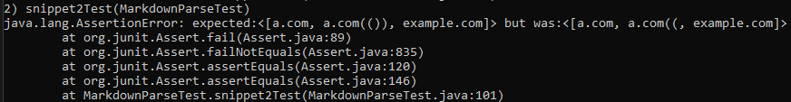
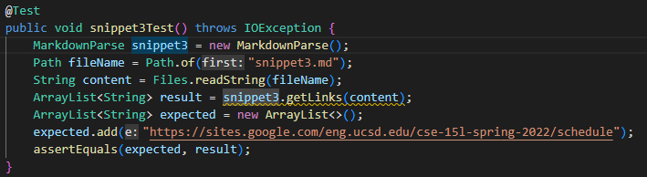
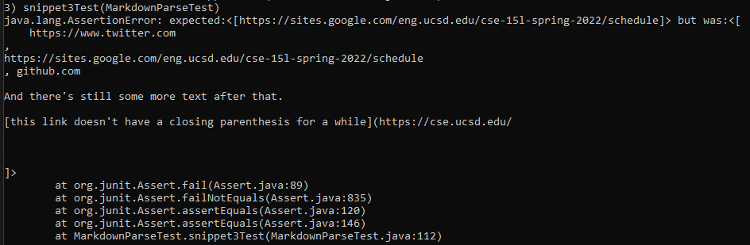

# **Week 4 Lab Report**
___
## Markdown-Parse Links

[My Markdown-Parse](https://github.com/Pahsuleyk/markdown-parser)

[Reviewed Markdown-Parse](https://github.com/katieki/markdown-parser)

For this writeup, we are going to run three specified tests on our Markdown-parse as well as another Markdown-Parse to see how each one runs them.
___
## Snippet 1
### Coded Test

The junit test for this snippet is expected to return `['google.com]`

### Running the test on my Markdown-Parse

Unfortunately, my Markdown-Parse failed to pass this test
___
## Snippet 2
### Coded Test

The junit test for this snippet is expected to return `[a.com, a.com(()), example.com]`

### Running the test on my Markdown-Parse

Unfortunately, my Markdown-Parse failed to pass this test
___
## Snippet 3
### Coded Test

The junit test for this snippet is expected to return `[https://sites.google.com/eng.ucsd.edu/cse-15l-spring-2022/schedule]`

### Running the test on my Markdown-Parse

Unfortunately, my Markdown-Parse failed to pass this test