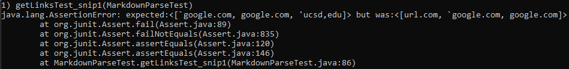

# **Week 4 Lab Report**
___
## Markdown-Parse Links

[My Markdown-Parse](https://github.com/Pahsuleyk/markdown-parser)

[Reviewed Markdown-Parse](https://github.com/katieki/markdown-parser)

For this writeup, we are going to run three specified tests on our Markdown-parse as well as another Markdown-Parse to see how each one runs them.
___
## Snippet 1
### Coded Test

The junit test for this snippet is expected to return `['google.com]`

### Running the test on my Markdown-Parse

Unfortunately, my Markdown-Parse failed to pass this test

### Running the test on another Markdown-Parse

Running the test on the reviewed Markdown-Parse repository ended up failing

### Is a Code Change Under 10 Lines Possible?
A code change can be made under 10 lines by making a checker for backticks. By creating a simple counter for backticks, one can make it so that if a open/closed braket or open parenthesis is withing a set of backticks, invalidate the link and break the loop, preventing the link from being in the output.
___
## Snippet 2
### Coded Test

The junit test for this snippet is expected to return `[a.com, a.com(()), example.com]`

### Running the test on my Markdown-Parse

Unfortunately, my Markdown-Parse failed to pass this test

### Running the test on another Markdown-Parse

Running the test on the reviewed Markdown-Parse repository ended up failing

### Is a Code Change Under 10 Lines Possible?
It is possible to make a code change under 10 lines for this snippet to account for extra parenthasis. Simply make a few lines of code and set up a counter for open brakets and parenthasis. Every open parenthasis/braket raises the count by 1 and every closed counterpart lowers the count by one. Once the counter starts, the momnet it hits 0 is when it should complete the link and therefore provide the full link output.
___
## Snippet 3
### Coded Test

The junit test for this snippet is expected to return `[https://sites.google.com/eng.ucsd.edu/cse-15l-spring-2022/schedule]`

### Running the test on my Markdown-Parse

Unfortunately, my Markdown-Parse failed to pass this test

### Running the test on another Markdown-Parse

Running the test on the reviewed Markdown-Parse repository ended up failing

### Is a Code Change Under 10 Lines Possible?
This actually might not be possible as the issues with this snippet are the new lines in between the brakets and parenthesis. I feel like it would take over 10 lines to create a functional fix towards these issues as you would have to make a checker for new lines inbetween the brakets and parenthesis which could prove a hassle as youd also have to make a condtion to check if a new line exists.