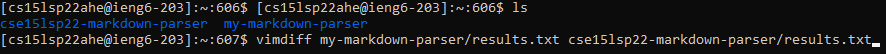
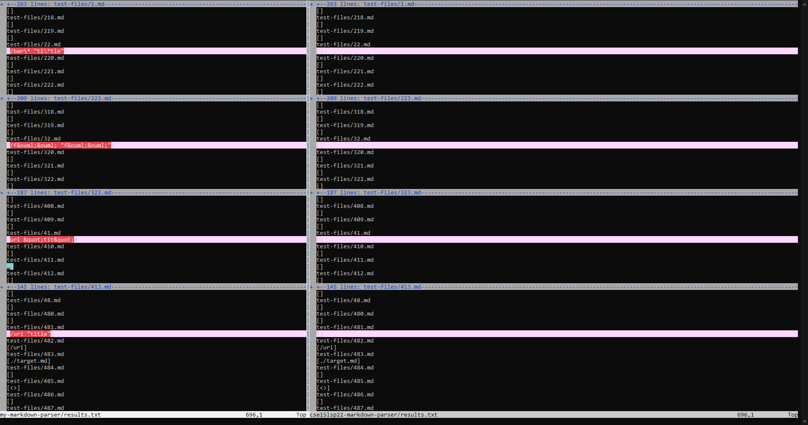
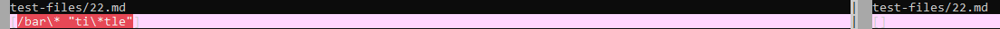
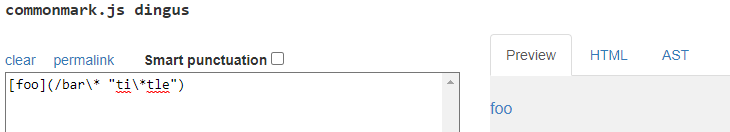
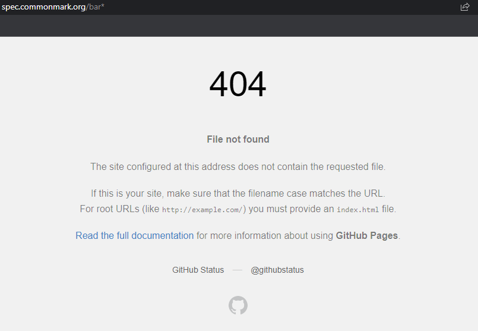

# **Week 10 Lab Report**
___
## How To Spot Tests With Different Results

The easiest way to check any difference in the test outputs is by using `vimdiff` on both of out `results.txt` files.

The result we get is as shown above. the highlighted lines are where different outputs have been detected between the files. Lets focus more on test files `22.md` and `41.md`.

___
## Difference #1 in Test file `22.md`

[Test File 22.md](https://github.com/nidhidhamnani/markdown-parser/blob/main/test-files/22.md)

Above shown is the test link as well as the outputs from the test. Unfortunately neither versions of `MarkdownParse.java` are correct.

By using [the CommonMark demo site](https://spec.commonmark.org/dingus/), we can see that the expected result should be `[bar*]` by plugging in the contents and clicking the preview link.

sdf

___
## Difference #2 in Test file `41.md`

https://github.com/nidhidhamnani/markdown-parser/blob/main/test-files/41.md