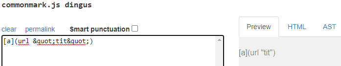

# **Week 10 Lab Report**
___
## How To Spot Tests With Different Results

The easiest way to check any difference in the test outputs is by using `vimdiff` on both of out `results.txt` files.

The result we get is as shown above. the highlighted lines are where different outputs have been detected between the files. Lets focus more on test files `22.md` and `41.md`.

___
## Difference #1 in Test file `22.md`

[Test File 22.md](https://github.com/nidhidhamnani/markdown-parser/blob/main/test-files/22.md)

Above shown is the test link as well as the outputs from the test. Unfortunately neither versions of `MarkdownParse.java` are correct.

By using [the CommonMark demo site](https://spec.commonmark.org/dingus/), we can see that the expected result should be `[bar*]` by plugging in the contents and clicking the preview link.

Looking at my implementation of `MarkdownParse.java`, the bug revealed from the output given is that it outputs everything within a set of open and closed parenthesis. Based on the expected output, any forward/backward slash within the parenthesis and any text within qutotations should not be included in the output.
I would have to implement new variables and make if statements to skip any slashes and text within quotations to get the expected result.

___
## Difference #2 in Test file `41.md`

[Test File 41.md](https://github.com/nidhidhamnani/markdown-parser/blob/main/test-files/41.md)

Above shown is the test link as well as the outputs from the test. This time only  my version of `MarkdownParse.java` is incorrect.

By using [the CommonMark demo site](https://spec.commonmark.org/dingus/), we can see that the expected result should be `[]` by plugging in the contents and clicking the preview link.

The bug with my implementation of `MarkdownParse.java` is that it outputs whatever is in a set of parenthasis even when it is not a proper hyperlink. In this error, the space within the link makes it an improper hyperlink. Since there is no actual quotation, the space ends up making the hyperlink ineffective. So based on my code snippet, I would have to implement a if statement that skips this line if it detects a space between 2 characters that isn't before or inbetween actual quotations.